## Projects

| Project | Stack | Docs |
|---------|-------|------|
| Video Transcoding Platform | `video-transcoding` | [projects/video-transcoding/README.md](projects/video-transcoding/README.md) |

## Deployment bootstrap

The GitHub Actions deploy workflow uses AWS OIDC by default. For the first run, or if the OIDC provider has not been created yet, set repository secrets named `AWS_BOOTSTRAP_ACCESS_KEY_ID` and `AWS_BOOTSTRAP_SECRET_ACCESS_KEY` so the workflow can deploy the shared security stack that creates the OIDC provider and deployment role.

The workflow switches back to OIDC immediately after `shared-security` is deployed, so the temporary bootstrap user does not need CloudWatch or SNS permissions.

Bootstrap credentials cannot attach inline IAM policies (for example when the bootstrap user is `transcoding-infra`). The workflow therefore deploys `shared-security` once with `CreateDeployUserIam=false`, assumes the OIDC role, then updates the stack with `CreateDeployUserIam=true` to attach `vtp-cloudformation-iam`.

The `transcoding-infra` CLI user receives scoped IAM permissions via `shared/security/deploy-user-iam.yaml` (policy name `vtp-cloudformation-iam`). Deploy `shared-security` first so that policy is attached before running `video-transcoding` with `CAPABILITY_NAMED_IAM`.

Set GitHub repository variables before deploying VTP:

- `DOMAIN_NAME` — root domain (CORS, email sender, URL outputs)
- `HOSTED_ZONE_ID` — Route 53 zone ID (creates `api.`, `app.`, `cdn.` records)
- `ALB_CERTIFICATE_ARN` — regional ACM cert (`ap-south-1`) for ALB (`api.`, `app.` subdomains)
- `CLOUDFRONT_CERTIFICATE_ARN` — **us-east-1** ACM cert for CloudFront `cdn.` subdomain

See [projects/video-transcoding/README.md](projects/video-transcoding/README.md) for ACM validation and smoke-test steps.
